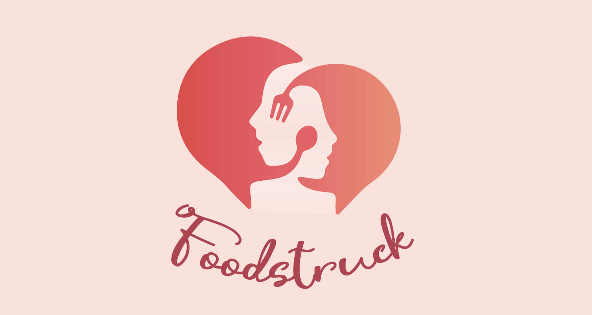
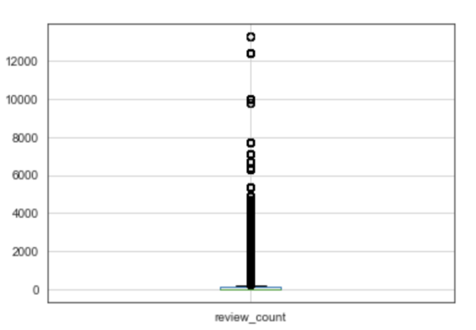
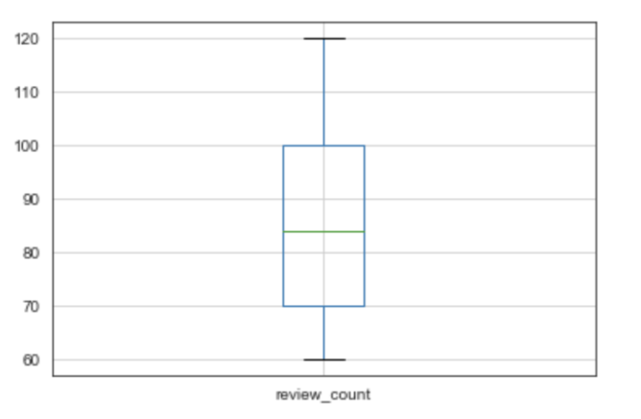
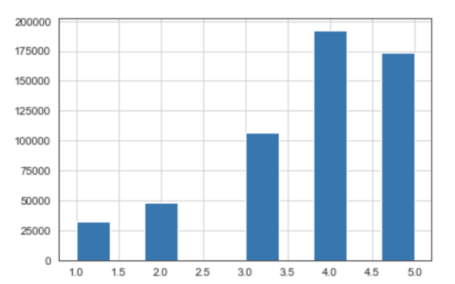
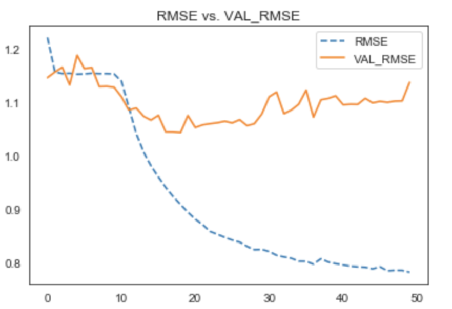

# Foodstruck - Dating App for Food Lovers

### Project Objectives 
- "Match" users using Natural Language Processing and Content-Based Recommendation System
- Recommend restaurants to the "matched users" using Collaborative Filtering System 
- Improve accuracy on recommendations using Neural Network Embeddings

### Dataset
Open Dataset from Yelp:
- 6 600 000+ Reviews/Ratings
- 190 000+ Businesses
- 1 600 000+ Users

### Exploratory Data Analysis and Data Processing

Because the range of number of review per user was huge (Maximum: 13000 reviews, Minimum: 1 review), and there were a lot of outliers, I decided to only get the users who have more than 60 and less than 120 reviews. 
Another feature engineering I did was to get only the businesses in Las Vegas. The reason was that there were many cities in this Yelp dataset, and the number of busisnesses per city was very different with Las Vegas having the most restaurants (30 000+).

 

After pre-processing, there are:
- Users: 31 000+
- Businesses: 18 000+
- Reviews: 700 000+
 

Another thing I want to mention is that the rating distribution is left skewed. I think the reason is because of "5-star rating bias" where people only rate places they like but do nothing for the restaurants that they don't like.

## "Match" User

The idea is that if 2 people have the same taste in food/restaurant and talk about something in the same way, the chance for them to like each other would be likely higher.

In this step, I performed Natural Language Processing on user's reviews to see how similar they are, and then group them together.

**Process:**
- Create Bag of Words (BoWs) for each user's reviews
- TF-IDF Vectorize the BoWs 
- Compute Cosine Similarity
- Using Cosine Similarity to group the users together

## Recommending Restaurants to Users

After "matching" the users together, the next step is to suggest a place for the couple to go to using Collaborative Filtering Recommendation System on the ratings. This is now a supervised machine learning task to predict the rating.

I created 2 KNN-based models using 2 different similarity metrics (Cosine Similarity and Pearson Correlation) 
- KNN Basic: 
  - RMSE using Cosine Similarity: 1.72
  - RMSE using Pearson Correlation: 1.71
- KNN Baseline: A basic collaborative filtering algorithm taking into account a baseline rating.
  - RMSE using Cosine Similarity: 1.61
  - RMSE using Pearson Correlation: 1.63
  
I also use Singular Value Decomposition to perfrom Matrix Factorization. RMSE for this model is 1.55 which is the best out of all 3 models. However, 1.55 out of 5 is still pretty high, so I decided to try Matrix Factorization using Neural Network Embeddings to improve the accuracy.
**Process:** I created an embedding for the users and one for the restaurants. Then compute dot product between the 

 

### Result
 

This is not the best model but it's the best out of all the ones I tested.
I tried different techniques like adding layers, add Drop-out, add Regularization. And the best RMSE I have is 1.04 which is 0.7 point better than base model.

#### Examples of Application: 

- These 2 users were matched 'GC-sitwrqrMkqYj-oTMRkA' and '7NyPj6trSAv0OJKyzdTuGQ' with a Similarity Score of 0.127. And the recommendations are:
    - Kung Fu Thai & Chinese Restaurant
    - Joyful House Chinese Cuisine
    - Shang Artisan Noodles
 Base on these recommendations, they seem to both like Asian food.
 
- These 2 users were matched 'l6BmjZMeQD3rDxWUbiAiow’  and ‘LKd_-BT2GMWp8_1ho18kOg’ with a Similarity Score of 0.145. An the recommendations:
    - The Buffet at Bellagio
    - Le Village
    - Paradise Buffet and Cafe
 Base on these recommendations, they seem to like buffet-style restaurant.

## Conclusion
- Model with the best performance is Neural Networok Embeddings with a RMSE of 1.04.
- One thing I want to mention is that the users who have more reviews and write longer reviews seem to have more matches.
- Though the idea is interesting to work on, I think that a few sentences about a restaurant or food are not enough to show if 2 people will like each other or not.
- More information on the users like favorite types of food, age, diet-restrictions and on the restaurants like location,  and price-range are needed for better prediction.

